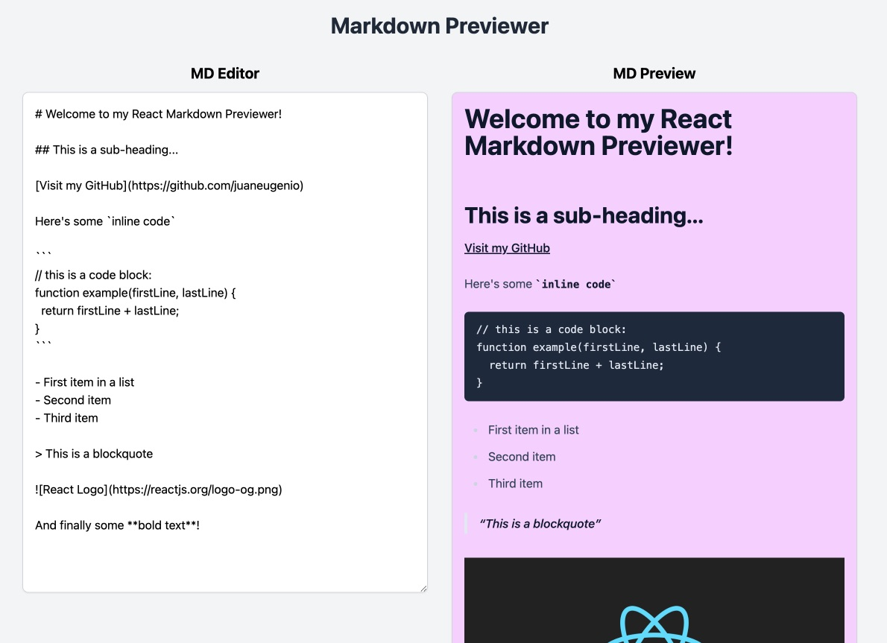

# Markdown Previewer

A React-based Markdown previewer that allows real-time preview of markdown text with GitHub flavored markdown support.

## Live Demo

[View Demo](https://juaneugenio.github.io/markdown-previewer/)



## Features

- Real-time markdown preview
- GitHub Flavored Markdown support
- Responsive design
- Support for:
  - Headers (H1-H6)
  - Links
  - Code blocks
  - Lists
  - Blockquotes
  - Images
  - Bold text
  - Inline code

## Technologies Used

- React 18
- Vite
- TailwindCSS
- Marked.js
- Jest & React Testing Library

## Installation

```bash
# Clone the repository
git clone https://github.com/juaneugenio/markdown-previewer.git

# Install dependencies
pnpm install

# Start development server
pnpm dev
````
## Testing
This project was originally based on freeCodeCamp's requirements. Due to known issues with React 18 and freeCodeCamp's test suite, custom tests were implemented to ensure all functionality meets the original requirements.

```bash

# Run tests
pnpm test

# Run tests in watch mode
pnpm test:watch

````
## Scripts
- pnpm dev - Start development server
- pnpm build - Build for production
- pnpm preview - Preview production build
- pnpm test - Run tests
- pnpm lint - Run linter
- pnpm deploy - Deploy to GitHub Pages
## Author
Juan C. Eugenio - [Visit my Portfolio](https://eugenioportfolio.netlify.app/)

## License
This project is private and not licensed for public use.